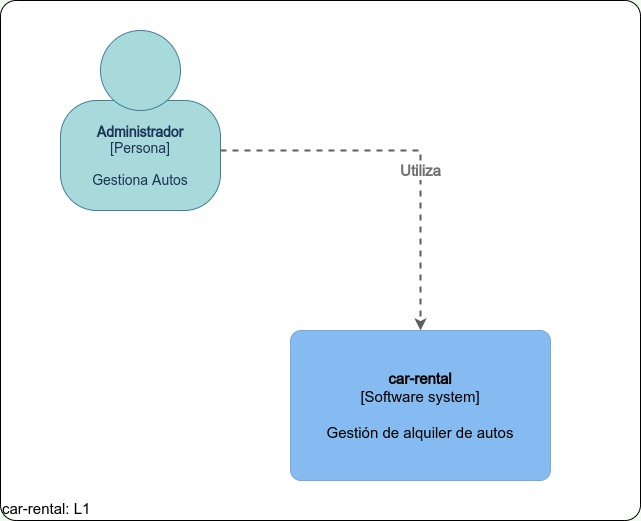

# gestion-alquiler-autos

Sistema de gestión de alquiler de autos.

Proyecto para r-argentina-programa

## Tecnologías

* HTML
* CSS
* Express
* Nunjucks
* Sequelize
* Jest

## Instalación

Requiere Node.js v12 o superior.

Ejecutar con 

```npm run dev```

## Diagramas C4




